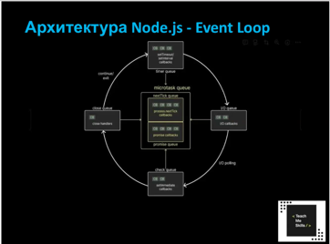

Node.js Основы


### Node.js: Основы
Однопоточная, событийно-ориентированная среда выполнения JS.

Работает на Ѵ8 + libuv (для асинхронного ввода-вывода).

Используется для серверов, CLI, утилит, стриминга и др.

- Несмотря на однопоточность, Node.js может обрабатывать множество соединений одновременно благодаря неблокирующей модели I/O.

- Под капотом используется libuv, которая реализует многопоточность в пуле потоков, но абстрагирует это от разработчика.

- Используется в крупных проектах: Netflix, PayPal, Linkedin, Uber.

- Node.js хорош для приложений, которые требуют высокой производительности и I/O-интенсивных операций - например, WebSocket-серверы, REST API, прокси-серверы.

Node.js не совсем подойдет для работы с видео, графикой так как потребляет значительно количество CPU

Самые популярные фреймворки Nest and Express.js

### Архитектура Node.js

Call Stack - стек вызовов JЅ-кода.
Event Loop - координирует выполнение кода, событий и коллбеков.
Callback Queue (Execute callback) — очередь задач, готовых к выполнению.
Thread Pool (Worker Threads) — пул потоков для работы с I/O операциями (libuv).


### Архитектура Node.js - EventLoop

Микротаски - processNextTick, Promises
Макротаски - setTimeout, setInterval, I/O callbacks, setImmediate, closeHandlers 


### Модуль FS

### Stream (поток)
Это абстракция для работы с данными по частям, а не целиком. Это особенно полезно при работе с большими файлами, HTTP- запросами, сокетами и т. д.
В Node.js стримы основаны на событиях и реализованы как экземпляры EventEmitter.
Readable - Поток для чтения данных Writable - Поток для записи данных
Duplex - Поток для записи и чтения данных
Transform - Duplex + возможность изменения данных (шифрование, сжатие и т.д.)

Почему небезопасно использовать асинхронные методы в продакшене?
Блокирует основную работу приложения

Почему стримы предпочтительны для работы с большими файлами?
Стримы позволяют не грузить все в память целиком чтобы избежать out of memory ошибок

### Gzip алгоритм сжатия файловв

Gzip — это алгоритм сжатия данных, широко используемый в вебе для уменьшения размера передаваемых файлов (HTML, CSS, JS, JSON и др.). B Node.js он реализован через модуль zlib.
С его помощью можно сжимать/распаковывать файлы и потоки, что особенно полезно в: работе с большими файлами, HTTP-серверах для сжатия ответов, экономии дискового пространства.

### Buffer

B Node.js буферы (Buffer) — это встроенный класс, предназначенный для работы с бинарными данными. Это особенно важно, когда нужно
обрабатывать данные, которые не являются строками — например, файлы, сетевые пакеты и т. п.
Buffer - это объект, который представляет собой фиксированную последовательность байтов. Он часто используется для работы с ТСР

```
// Создание буффера из строки
const buf1 = Buffer.from('Hello', 'utf-8');

// Создание буффера на 10 байт
const buf2 = Buffer.alloc(10);

// Создание небезопасного буффера, может сожержать мусор
const buf3 = Buffer.allocUnsafe(10);
```
### Пример: чтение PNG и конвертация в Base64
Base64 только ASCII symbols

### EventEmitter и события (примеры)
Node.js построен на асинхронной обработке событийно-ориентированной архитектуре, где операции не блокируют выполнение,
а исполняются, когда готовы, с помощью колбэков или событий

### Пример: Logger с событиями построенный на EventEmitter

### Модули http and net
https - высокоуровневый модуль, который используется для создания веб-серверов
net - работает с TCP соединениями напрямую без привязки к http. Он ниже уровнем
и дает полный контроль над байтами, может использоваться для чатов, прокси, игр.

### Пример: TCP-чат сервер
TCP сетевой протокол, который обеспечивает надежную передачу данных
Обеспечивает разбиение на пакеты, гарантирует отправку и переотправку, работает на транспортном уровне
Для работы в Node.js есть модуль net

* Если есть type: module в package.json, то можно использовать import
* Если файл с расширением .mjs, то можно использовать import
